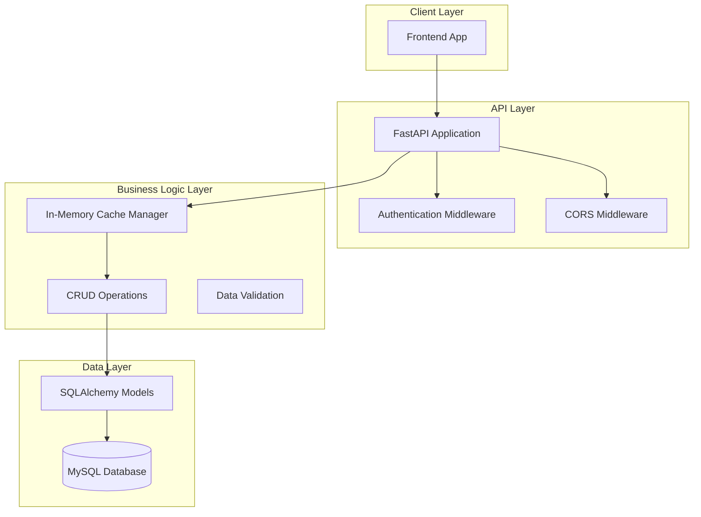
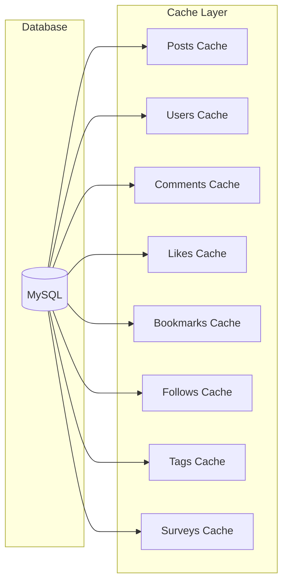

# Design Document

## Overview

The TOMOSU backend API is designed as a high-performance, cache-optimized MVP system that provides essential social networking functionality for local community engagement. The system prioritizes fast response times through in-memory caching while maintaining a simplified authentication model suitable for MVP validation.

The architecture follows FastAPI best practices with a clear separation of concerns between data access, business logic, and API presentation layers. The system is optimized for Azure Container Apps deployment with horizontal scaling capabilities.

## Architecture

### System Architecture



### Cache Architecture



## Components and Interfaces

### 1. Cache Manager Component

**Purpose**: Manages all in-memory data caching for optimal performance

**Key Classes**:
- `CacheManager`: Central cache coordination
- `PostsCache`: Handles posts and related data
- `UsersCache`: Manages user information
- `RelationsCache`: Handles likes, bookmarks, follows

**Interface**:
```python
class CacheManager:
    async def initialize() -> bool
    async def get_posts(skip: int, limit: int) -> List[PostResponse]
    async def get_posts_by_tag(tag_name: str, skip: int, limit: int) -> List[PostResponse]
    async def get_user_profile(user_id: int) -> UserResponse
    async def add_post_to_cache(post_data: dict) -> PostResponse
    async def get_cache_stats() -> dict
```

### 2. Authentication Component

**Purpose**: Provides simplified MVP authentication using fixed user sessions

**Key Classes**:
- `AuthManager`: Handles session management
- `SessionMiddleware`: Validates requests

**Interface**:
```python
class AuthManager:
    def create_session(user_id: int) -> str
    def validate_session(session_token: str) -> Optional[int]
    def get_current_user() -> UserResponse
    def logout_session(session_token: str) -> bool
```

### 3. API Endpoints Component

**Purpose**: Defines RESTful API endpoints with proper HTTP semantics

**Endpoint Groups**:
- `/api/v1/auth/*` - Authentication endpoints
- `/api/v1/posts/*` - Posts management
- `/api/v1/users/*` - User profiles and relationships
- `/api/v1/tags/*` - Tag management
- `/api/v1/surveys/*` - Survey functionality
- `/api/v1/system/*` - Health checks and monitoring

### 4. Data Validation Component

**Purpose**: Ensures data integrity using Pydantic models

**Key Models**:
- `PostRequest`, `PostResponse`
- `UserResponse`, `UserProfileUpdate`
- `CommentResponse`
- `SurveyResponse`

## Data Models

### API Response Models

```python
# User Models
class UserResponse(BaseModel):
    user_id: int
    username: str
    display_name: Optional[str]
    profile_image_url: Optional[str]
    bio: Optional[str]
    area: Optional[str]
    created_at: datetime

class UserProfileResponse(UserResponse):
    followers_count: int
    following_count: int
    posts_count: int

# Post Models
class PostResponse(BaseModel):
    post_id: int
    user_id: int
    content: str
    created_at: datetime
    updated_at: datetime
    author: UserResponse
    tags: List[TagResponse]
    likes_count: int
    comments_count: int
    is_liked: bool
    is_bookmarked: bool

class PostRequest(BaseModel):
    content: str
    tags: Optional[List[str]] = []

# Comment Models
class CommentResponse(BaseModel):
    comment_id: int
    post_id: int
    user_id: int
    content: str
    created_at: datetime
    author: UserResponse

# Tag Models
class TagResponse(BaseModel):
    tag_id: int
    tag_name: str
    posts_count: int

# Survey Models
class SurveyResponse(BaseModel):
    survey_id: int
    title: str
    question_text: str
    points: int
    deadline: Optional[datetime]
    target_audience: str
    created_at: datetime
    response_count: int
```

### Cache Data Structures

```python
# Cache storage structures
CacheData = {
    "posts": Dict[int, PostResponse],
    "users": Dict[int, UserResponse],
    "comments": Dict[int, List[CommentResponse]],  # post_id -> comments
    "likes": Dict[int, Set[int]],  # post_id -> user_ids
    "bookmarks": Dict[int, Set[int]],  # user_id -> post_ids
    "follows": Dict[int, Set[int]],  # user_id -> following_user_ids
    "tags": Dict[str, List[int]],  # tag_name -> post_ids
    "surveys": Dict[int, SurveyResponse]
}
```

## Error Handling

### Error Response Model

```python
class ErrorResponse(BaseModel):
    error_code: str
    message: str
    details: Optional[dict] = None
    timestamp: datetime
```

### Error Categories

1. **Authentication Errors (401)**
   - Invalid session token
   - Session expired
   - Missing authentication

2. **Authorization Errors (403)**
   - Insufficient permissions
   - Resource access denied

3. **Validation Errors (422)**
   - Invalid request data
   - Missing required fields
   - Data format errors

4. **Not Found Errors (404)**
   - Resource not found
   - Invalid endpoint

5. **Server Errors (500)**
   - Cache initialization failure
   - Database connection errors
   - Unexpected system errors

### Error Handling Strategy

```python
# Global exception handler
@app.exception_handler(ValidationError)
async def validation_exception_handler(request: Request, exc: ValidationError):
    return JSONResponse(
        status_code=422,
        content=ErrorResponse(
            error_code="VALIDATION_ERROR",
            message="Request validation failed",
            details=exc.errors(),
            timestamp=datetime.utcnow()
        ).dict()
    )
```

## Testing Strategy

### 1. Unit Testing

**Scope**: Individual components and functions
**Framework**: pytest
**Coverage Target**: 90%

**Test Categories**:
- Cache operations testing
- CRUD functions testing
- Data validation testing
- Authentication logic testing

### 2. Integration Testing

**Scope**: API endpoints and database interactions
**Framework**: pytest + httpx
**Coverage**: All API endpoints

**Test Scenarios**:
- API endpoint response validation
- Database transaction integrity
- Cache consistency verification
- Error handling validation

### 3. Performance Testing

**Scope**: Response time and throughput validation
**Framework**: pytest-benchmark
**Targets**:
- 95% of requests under 200ms
- Cache initialization under 5 seconds
- Support for 100 concurrent users

### 4. Load Testing

**Scope**: System behavior under load
**Framework**: locust
**Scenarios**:
- Gradual load increase
- Spike testing
- Sustained load testing

### Test Data Strategy

```python
# Test fixtures for consistent data
@pytest.fixture
def sample_posts():
    return [
        {
            "post_id": 1,
            "user_id": 1,
            "content": "地域のお祭り情報です！",
            "tags": ["イベント", "お祭り"]
        },
        # ... more test data
    ]

@pytest.fixture
def mock_cache_manager():
    # Mock cache manager for isolated testing
    pass
```

## Performance Optimization

### 1. Cache Strategy

- **Startup Cache Loading**: All data loaded into memory on application start
- **Cache Invalidation**: No cache invalidation for MVP (read-only after startup)
- **Memory Management**: Efficient data structures to minimize memory usage

### 2. Database Optimization

- **Connection Pooling**: SQLAlchemy connection pool configuration
- **Query Optimization**: Efficient joins and indexing
- **Batch Operations**: Bulk data loading for cache initialization

### 3. API Optimization

- **Response Compression**: Gzip compression for large responses
- **Pagination**: Consistent pagination across all list endpoints
- **Field Selection**: Optional field filtering for reduced payload size

### 4. Monitoring and Metrics

```python
# Performance monitoring endpoints
@app.get("/api/v1/system/health")
async def health_check():
    return {
        "status": "healthy",
        "cache_status": cache_manager.get_status(),
        "response_time": "< 200ms",
        "uptime": get_uptime()
    }

@app.get("/api/v1/system/metrics")
async def get_metrics():
    return {
        "cache_size": cache_manager.get_cache_size(),
        "request_count": metrics.get_request_count(),
        "average_response_time": metrics.get_avg_response_time(),
        "error_rate": metrics.get_error_rate()
    }
```

## Security Considerations

### 1. Authentication Security

- **Session Management**: Secure session token generation
- **Cookie Security**: HttpOnly, Secure, SameSite attributes
- **Session Expiration**: Configurable session timeout

### 2. Data Protection

- **Input Validation**: Comprehensive request validation
- **SQL Injection Prevention**: SQLAlchemy ORM usage
- **XSS Prevention**: Proper data sanitization

### 3. API Security

- **CORS Configuration**: Restricted origin access
- **Rate Limiting**: Request rate limiting per IP
- **Request Size Limits**: Maximum payload size restrictions

## Deployment Architecture

### Azure Container Apps Configuration

```yaml
# Container configuration
resources:
  cpu: 1.0
  memory: 2Gi
scaling:
  minReplicas: 1
  maxReplicas: 5
  rules:
    - name: "http-scaling"
      http:
        metadata:
          concurrentRequests: "100"
```

### Environment Configuration

```python
# Environment-specific settings
class Settings(BaseSettings):
    database_url: str
    cache_size_limit: int = 1000000  # 1M records
    session_timeout: int = 3600  # 1 hour
    cors_origins: List[str] = ["http://localhost:3000"]
    log_level: str = "INFO"
    
    class Config:
        env_file = ".env"
```

## API Documentation

### OpenAPI Specification

The API will be fully documented using FastAPI's automatic OpenAPI generation with:
- Comprehensive endpoint descriptions
- Request/response schema documentation
- Example requests and responses
- Error code documentation

### API Versioning

- Base path: `/api/v1/`
- Version header support for future versions
- Backward compatibility maintenance